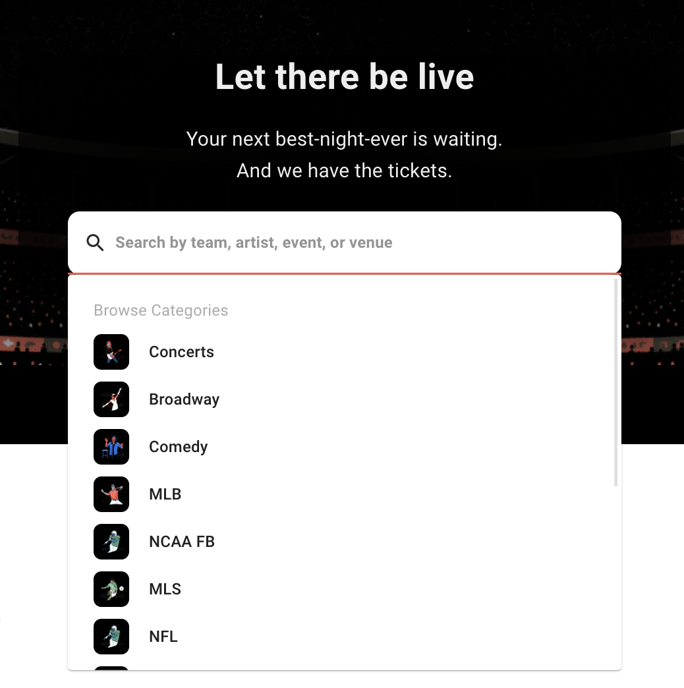
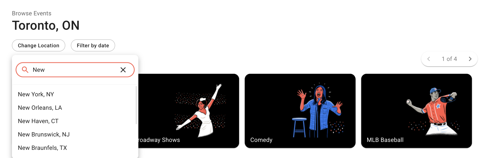
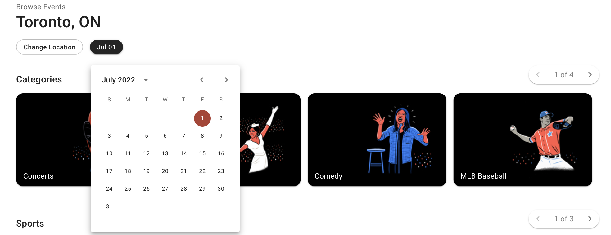
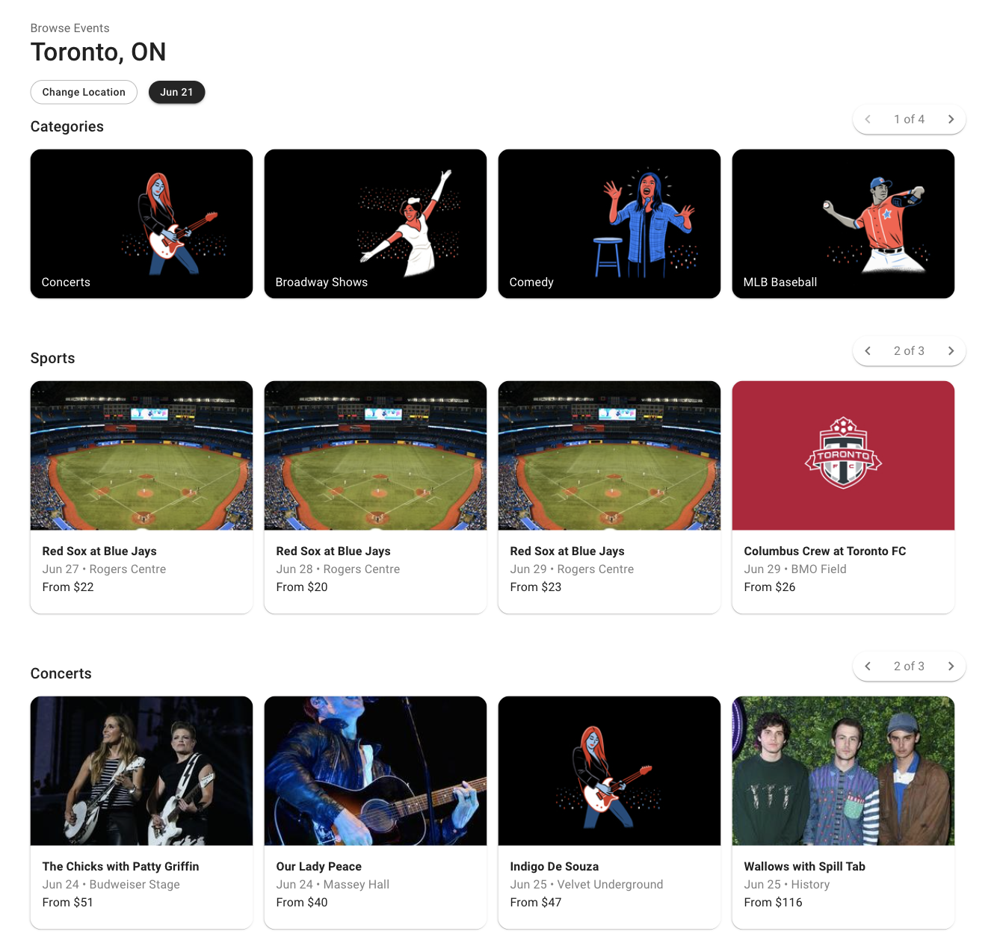

# Seat Geek Clone

This is a clone of [seatgeek.com](https://www.seatgeek.com), a ticketing platform for buying and selling tickets for live sports, concerts, and theatre events.

The purpose of this project was to practice building a frontend application using React. My goal was to match the original site's design as close as possible.

[Go to site](https://seatgeekclone.herokuapp.com/)

## Features

### Search Suggestions

The main search bar has a dropdown menu with popular categories to select from.

### Reverse Geocoding and Autocomplete

On page load, the user's current location is determined as follows:

- Coordinates (latitude, longitude) obtained from the builtin Navigator Web API
- Mapbox API used to obtain city name based on coordinates through reverse geocoding

The user can also search for other locations using the text input. Mapbox API also provides the autocomplete functionality once a user has typed 3 or more characters.

### Date Filter

Using the dropdown datepicker, results can be filtered to only show events on or after the user's selected date.

### Event Results

Results are displayed as shown above, grouped into categories and paginated at each row. Event details include event title, date, venue, and lowest available ticket price.

## Technology Used

- React, MUI, create-react-app
- SeatGeek API: [https://platform.seatgeek.com/](https://platform.seatgeek.com/)
- Mapbox API [https://docs.mapbox.com/api/overview/](https://docs.mapbox.com/api/overview/)
- Heroku
